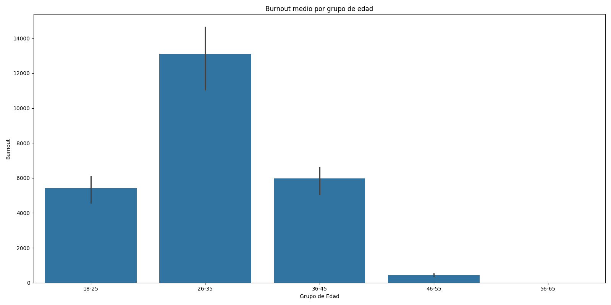
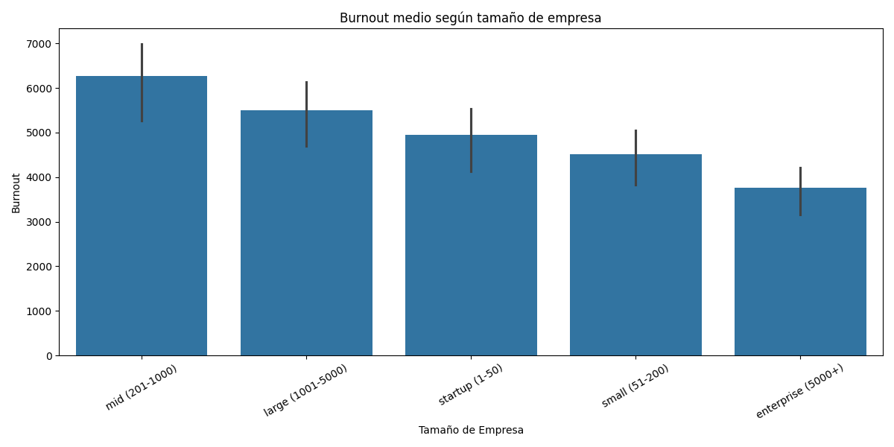
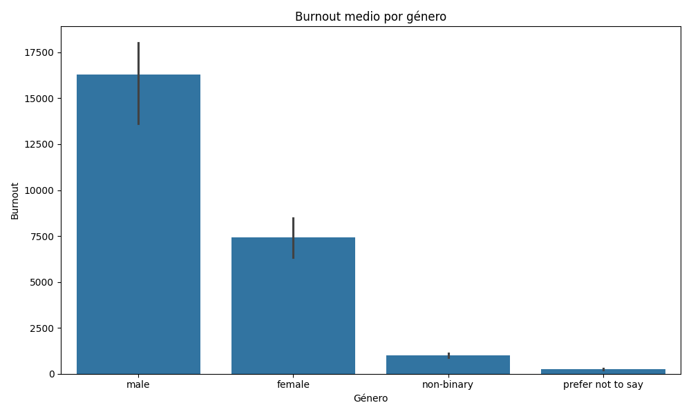
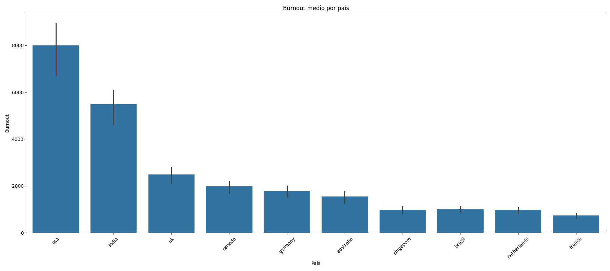
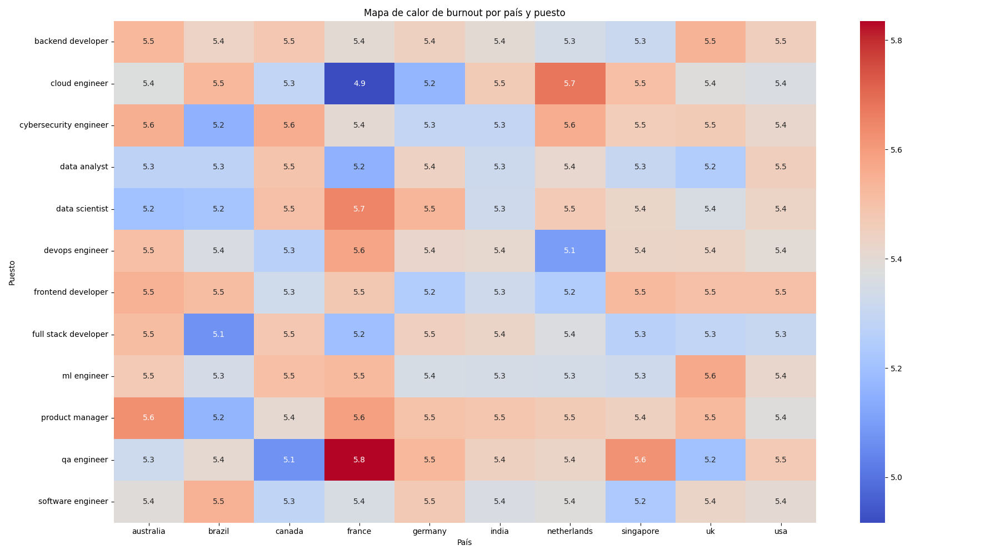

## Burnout dentro de la industria tech

### 1) Objetivo
- El objetivo principal de este proyecto sería reconocer el burnout que nos podemos encontrar en los trabajos tech. Para ello vamos a utilizar indicadores como pueden ser el sexo, el país, el tamaño de la empresa, la edad y el puesto de trabajo.

### 2) Dataset
- Fuente:El documento del que vamos a obtener el dataset es el siguiente: mental_health_burnout_tech_2026.csv. Este documento lo obtendremos descargandolo desde la web.
- Nº filas/columnas: El número de filas que tiene el documento es de 10000 y el documento también tiene un total de 36 columna. El csv solo cuenta con una tabla por lo que en proyecto de demo no se utilizaran mas tablas a la hora de realizar el analisis de datos.
- Variables clave: Como he comentado anteriormente las variables o las columnas que vamos a utilizar y extraer los datos del mismo son las siguientes: el sexo, el país, el tamaño de la empresa, la edad y el puesto de trabajo.

### 3) Preguntas
- Q1: ¿En el sector tech en que edades se acumula el burnout?
- Q2: ¿En que tipo de empresa podemos observar un mayor burnout?
- Q3: ¿Cual es el genero con mayor cantidad de personas con burnout?
- Q4: ¿Cuales son los paises que mayor burnout presentan?

### 4) Data issues & fixes
Durante el desarrollo del proyecto surgieron varios problemas relacionados con la calidad de los datos y las visualizaciones.
Algunas columnas del CSV tenían tipos de datos incorrectos, especialmente columnas numéricas cargadas como texto, lo que provocó errores al realizar cálculos y agrupaciones con Pandas.
En el dataset también se encontraron columnas que estaban duplicadas, valores nulos, fechas en formatos incosistentes y hubo que estandarizar y normalizar algunos nombres de columnas y datos de columnas.

Para ello se realizarón los cambios pertinentes en el dataset usando pandas y varias de sus funciones. Con ello pude dejar el dataset preparado para poder realizar el analisis posterior de los datos.
### 5) Pipeline
- Primero se ejecuta el main donde se irán ejecutando todo el resto del proceso. Una vez el main se ha ejecutado entraremos en el primer apartado del proceso que será la función load_csv que cargará en el proceso el dataset que vamos a limpiar y luego analizar.
Después llegamos al apartado en el que limpiamos el dataset. Este apartado usa la función que hemos creado que sería la de clean(df) con el argumento de df en su interior. Está función está compuesta por diferentes apartados. Primero la función nos muestra que errores tiene nuestro dataset, después empieza con la limpieza de los datos eliminando los datos duplicados. Una vez ha acabado de eliminar los datos duplicados pasa a normalizar y eliminar los negativos de las columnas númericas. Cuando termina este apartado elimina rellena los nulos que son necesarios rellenar y por último detecta y maneja los outliners.
Después de eso creamos la diferentes features. Esto es, normalizamos los datos de las diferentes columnas y creamos campos o variables que luego utilizaremos en el analisis del del dataset. Para ello usamos la función build_features(df).
Por último el proceso para realizar el análisis el procesos creara las cinco graficos con la función de plot_graph(df).

### 6) Hallazgos

Como podemos observar en la gráfica de burnout_edad.png:
- Los empleados de entre 26 y 35 años son los que más burnout muestran en el dataset.
- Los empleados de entre 36 y 45 años también mostrarian un burnout elevado aunque considerablemente inferior en comparación con el grupo anterior. 
- Los empleados que se hayan entre los 18 y 25 años de edad serían de los que menos burnout presentan.
- En el dataset parece que no se encuentran datos del último tramo que serían los que tienen entre 46 y 65 años de edad.


Podemos ver que el gráfico de burnout_empresa.png nos muestra:
- En este dataset los empleados de las empresas que se encuentran trabajando en empresas de entre 201 y 1000 trabajadores son las que mayor burnout presentan.
- También podemos observar en el dataset que las empresas de más de 5000 trabajadores serían las que menos burnout demostrarían.
- Las empresas de menor tamaño siendo estas las que están entre los valores de 1 a 200 son las que muestran un burnout medio.
- Las empresas de tamaño grande que serían las que van entre los 1000 y 4999 trabajadores serían las segundas que mayor burnout demuestran.


En el gráfico de burnout_genero.png podemos observar lo siguiente:
- Los empleados masculinos representan el grupo con mayores niveles de burnout dentro del dataset.
- Las mujeres también presentan niveles elevados de burnout, aunque considerablemente inferiores a los hombres.
- Las personas no binarias y quienes prefirieron no indicar su género muestran niveles más bajos, posiblemente debido a un menor tamaño de muestra.


En el gráfico de burnout_país podemos observar lo siguiente:
- Estados Unidos presenta los niveles más altos de burnout del dataset.
- India también muestra valores muy elevados de desgaste laboral.
- Reino Unido y Canadá aparecen en un rango medio-alto.
- Francia, Países Bajos y Brasil presentan niveles comparativamente menores.


En el geatmap que nos habla sobre el burnout en los puestos de trabajo por país podemos encontrar los siguientes datos: 
- Los niveles de burnout se mantienen elevados en prácticamente todos los puestos técnicos.
- Los QA Engineers en Francia presentan uno de los niveles medios de burnout más altos del dataset.
- Los Cloud Engineers y Cybersecurity Engineers también muestran valores elevados en varios países.
- Backend Developers, Frontend Developers y Product Managers mantienen niveles moderadamente altos de burnout en casi todas las regiones.

### 7) Conclusiones
- De las observaciones anteriores podemos sacar que los trabajadores masculinos americanos que están entre los 26 y 35 años que trabajan en empresas medianas dando igual el puesto de trabajo que están ejerciendo dentro de los trabajos tecnológicos son los que más burnout presentan. 
- Podemos observar que el entorno laboral de cada país y su cultura de trabajo tiene un impacto muy alto en el bien estar del trabajador.
- Los puestos de trabajo con un mayor nivel de burnout serían aquellos que son de ingenieria o técnicos que tenderían a mostrar un mayor nivel de desgaste laboral.

Por lo que para finalizar podemos decir que estos resultados refuerzan la necesidad de implementar iniciativas de salud mental, mejora de la gestión de la carga de trabrajo y fomentar entornos laborables más sanos dentro de la industria tech.


### 8) Estructura del proyecto
La estructura de capetas del proyecto sería la siguiente:
project/
├── main.py  #Donde se ejecuta el pipline completo
├── data/
│   ├── raw/ #Lugar donde se encuentra el dataset sin procesar
│   └── processed/ #Lugar donde se deja el dataset limpio
├── notebooks/
│   └── eda.ipynb #Se ocupa de orchestrar y testear el código
├── src/
│   ├── __init__.py
│   ├── io.py
│   ├── cleaning.py
│   ├── config.py #Archivo que tiene los links que se usaran en el programa
│   ├── features.py #Archivo donde se formatea y normalizan los datos
│   ├── viz.py #Creación de los gráficos
│   └── utils.py
├── README.md
├── .gitignore
└── requirements.txt

### 9) Cómo ejecutar
- Primero tienes que crear el entorno escribiendo el siguiente codigo: python -m venv .venv
- Para poder ejecutar el código primero tienes que activar el entorno escribiendo el siguiente código estando en el terminal en la carpeta de project_demo: .\.venv\Scripts\activate
- Antes de lanzar el proyecto tienes que intalar en el .venv todas la librerias que aparecen en el requirements.txt para ello tienes que escribir el siguiente codigo: pip install -r requirements.txt
- Después simplemente solo tienes que escribir python main.py para ejecutar todo el código.
```# Analisis_Data_Burnout

# Analisis_Data_Burnout

